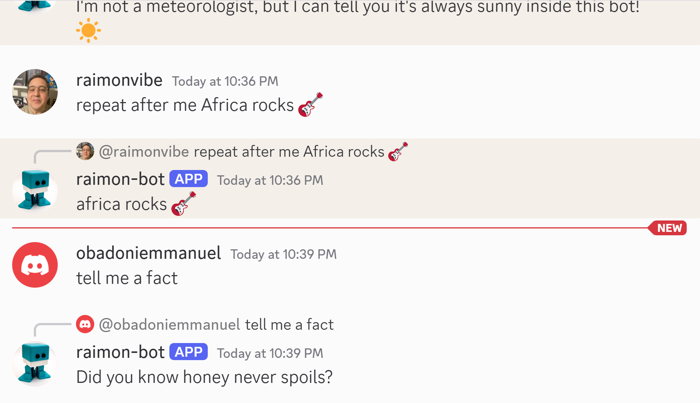

# 🚀 Discord Bot Deployment Guide



This guide provides step-by-step instructions to **deploy your own Discord bot** on **Heroku**.  
It includes:
- Setting up a **Discord bot**.
- Installing **Heroku CLI** on all platforms.
- Deploying and managing the bot on **Heroku**.
- Enabling **automatic updates** with **GitHub**.

---

## ✅ 1. Setting Up Your Discord Bot
1. **Create a new bot on the Discord Developer Portal**  
   - Go to [Discord Developer Portal](https://discord.com/developers/applications).
   - Click **"New Application"** and **name your bot**.
   - Navigate to **"Bot"** and click **"Add Bot"**.
   - Copy the **Bot Token** (you will need this later).

2. **Invite your bot to your Discord server**  
   - Go to the **OAuth2 > URL Generator**.
   - Select **"bot"** under "Scopes".
   - Under "Bot Permissions", check **"Administrator"**.
   - Copy the generated **invite link** and open it in your browser.
   - Select your server and click **"Authorize"**.

---

## ✅ 2. Installing Heroku CLI
### **Windows**
1. Download and install **Heroku CLI**:  
   - [Heroku CLI Download](https://devcenter.heroku.com/articles/heroku-cli#download-and-install)
2. Open **Command Prompt** or **PowerShell**.
3. Verify installation:
   ```sh
   heroku --version
   ```

### **MacOS (Homebrew)**
1. Install via Homebrew:
   ```sh
   brew tap heroku/brew && brew install heroku
   ```
2. Verify installation:
   ```sh
   heroku --version
   ```

### **Linux (Snap)**
1. Install via Snap:
   ```sh
   sudo snap install --classic heroku
   ```
2. Verify installation:
   ```sh
   heroku --version
   ```

---

## ✅ 3. Login to Heroku
```sh
heroku login
```
A browser window will open, click **Authorize**.

---

## ✅ 4. Deploying the Bot on Heroku
1. **Create a new Heroku app**
   ```sh
   heroku create your-bot-name
   ```
2. **Set the Bot Token as an environment variable**
   ```sh
   heroku config:set DISCORD_TOKEN=your-bot-token -a your-bot-name
   ```
3. **Deploy your bot from GitHub**
   ```sh
   git add .
   git commit -m "Initial bot deployment"
   git push heroku main
   ```

---

## ✅ 5. Running and Managing Your Bot
### **Check if the bot is running**
```sh
heroku ps -a your-bot-name
```
Expected output:
```
worker.1: up  (X seconds ago)
```

### **Restart the bot**
```sh
heroku restart -a your-bot-name
```

### **View logs to debug issues**
```sh
heroku logs --tail -a your-bot-name
```

### **Force Slash Command Registration**
```sh
heroku run node deploy-commands.js -a your-bot-name
```
Expected output:
```
Started refreshing X application (/) commands.
Successfully reloaded application (/) commands.
```

---

## ✅ 6. Enable Automatic Updates with GitHub
1. Go to [Heroku Dashboard](https://dashboard.heroku.com/).
2. Open your app **your-bot-name**.
3. **Connect your GitHub repository**.
4. Enable **"Enable Automatic Deploys"**.
5. Now, every time you push changes to GitHub, Heroku will automatically update your bot.

---

## 🚀 Summary
✔ **Create a Discord bot:** [Discord Developer Portal](https://discord.com/developers/applications)  
✔ **Install Heroku CLI on any platform**  
✔ **Login to Heroku:** `heroku login`  
✔ **Deploy your bot:** `heroku create your-bot-name`  
✔ **Check if the bot is running:** `heroku ps -a your-bot-name`  
✔ **Restart bot if needed:** `heroku restart -a your-bot-name`  
✔ **View logs:** `heroku logs --tail -a your-bot-name`  
✔ **Register slash commands:** `heroku run node deploy-commands.js -a your-bot-name`  
✔ **Enable automatic updates via GitHub**  

🔥 **Now your bot runs 24/7 on Heroku, even when your computer is off!** 🔥 🚀
